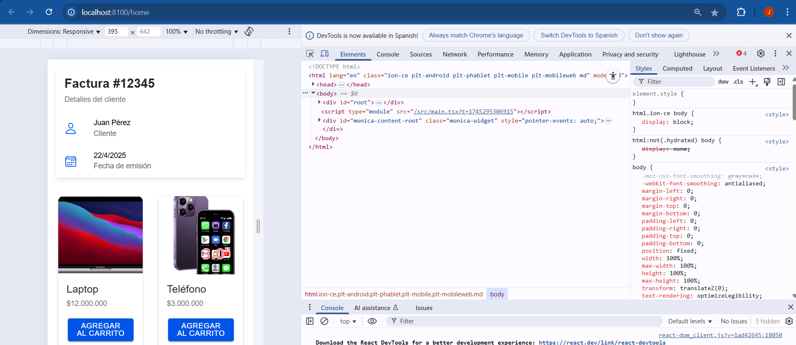

# HU-002: Encabezado de Factura  

**Como**: Cliente  
**Quiero**: Ver los datos de mi factura (número, nombre y fecha)  
**Para**: Tener un comprobante de mi compra  

## 📝 Descripción  
Mostrar un resumen claro de la factura con información básica del cliente y la transacción.  

## ✅ Criterios de Aceptación  
- [ ] Mostrar número de factura único (ej: `#12345`).  
- [ ] Incluir campos:  
  - **Cliente**: Nombre ingresado.  
  - **Fecha**: Actual (formato `DD/MM/AAAA`).  
- [ ] Diseño limpio con iconos (`personOutline`, `calendarOutline`).  

## 🔧 Tareas Técnicas (Opcional)  
- Crear componente `Factura.tsx` con `IonCard`.  
- Props: `cliente: string`, `fecha: string`.  

## 📸 Captura de Diseño  

**Prioridad**: Media  
**Etiquetas**: `HU`, `frontend`, `factura`