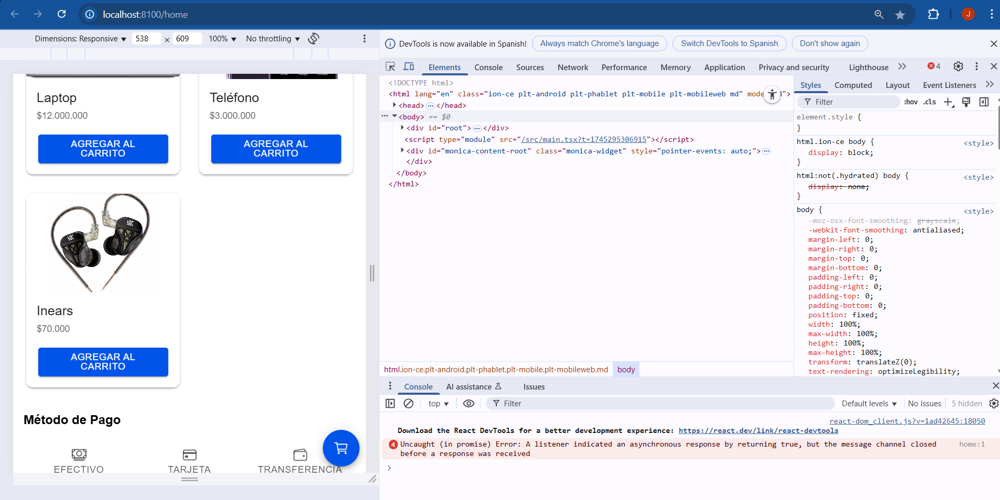

# HU03: Métodos de Pago  

**Como**: Cliente  
**Quiero**: Elegir cómo pagar (efectivo, tarjeta o transferencia)  
**Para**: Completar mi compra según mi preferencia  

## 📝 Descripción  
Ofrecer opciones de pago intuitivas con selección única y retroalimentación visual.  

## ✅ Criterios de Aceptación  
- [ ] Mostrar 3 métodos:  
  - Efectivo (icono `cashOutline`).  
  - Tarjeta (icono `cardOutline`).  
  - Transferencia (icono `walletOutline`).  
- [ ] Permitir solo una selección a la vez.  
- [ ] Guardar la selección al cambiar de pantalla.  

## 🔧 Tareas Técnicas (Opcional)  
- Crear componente `Pagos.tsx` con `IonSegment`.  
- Evento `onIonChange` para capturar la selección.  

## 📸 Captura de Diseño  

**Prioridad**: Alta  
**Etiquetas**: `HU`, `frontend`, `pagos`