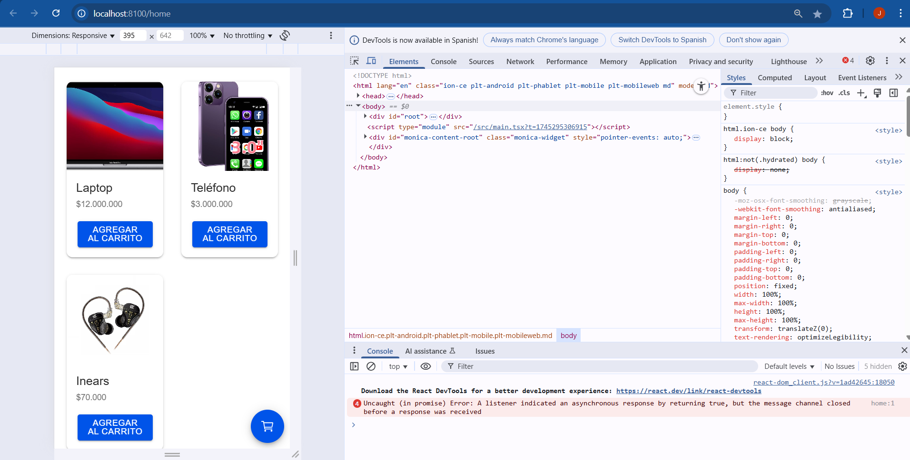

# HU01: Lista de Productos  

**Como**: Cliente  
**Quiero**: Ver una lista de productos con imágenes y precios  
**Para**: Poder seleccionar lo que deseo comprar  

## 📝 Descripción  
Los usuarios deben visualizar los productos disponibles en una cuadrícula organizada, con detalles claros y la opción de agregarlos al carrito.  

## ✅ Criterios de Aceptación  
- [ ] Mostrar al menos 3 productos en un grid responsive.  
- [ ] Cada producto debe incluir:  
  - Imagen.  
  - Nombre.  
  - Precio (formateado, ej: `$1,200`).  
- [ ] Botón "Agregar al carrito" que guarde el producto seleccionado.  

## 🔧 Tareas Técnicas (Opcional)  
- Crear componente `Productos.tsx` con `IonGrid`.  
- Usar datos mock (ejemplo: laptops, teléfonos, Inears).  
- Implementar función `agregarAlCarrito`.  

## 📸 Captura de Diseño  
 

**Prioridad**: Alta  
**Etiquetas**: `HU`, `frontend`, `productos`