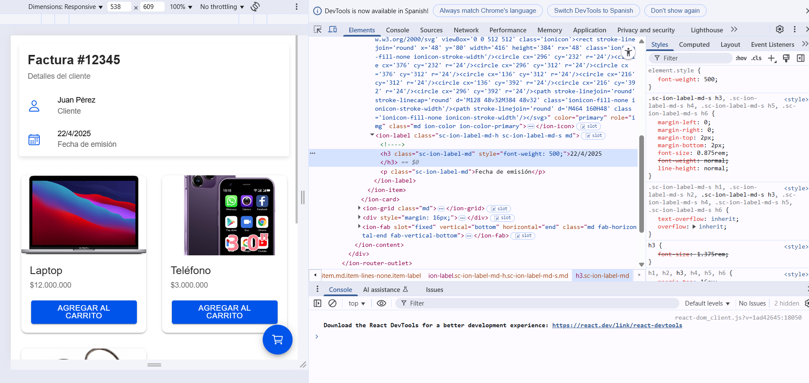
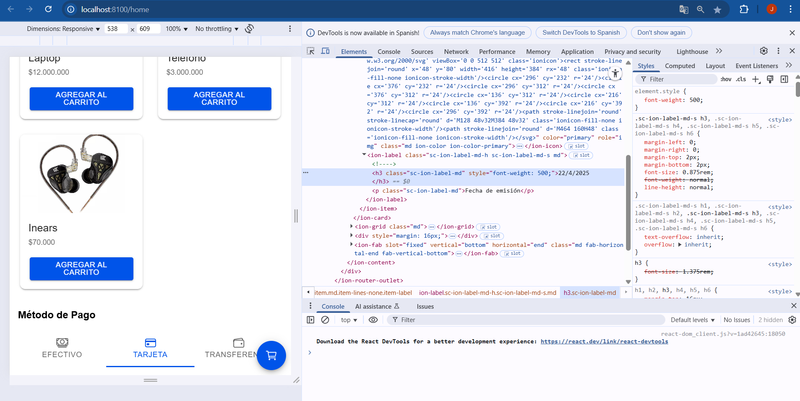

# HU04: Pantalla Principal Integrada

**Como:** Cliente  
**Quiero:** Tener una pantalla única que integre todos los componentes (productos, factura y métodos de pago)  
**Para:** Poder realizar todo el proceso de compra sin cambiar de vista

---

## Descripción

Desarrollar una pantalla principal en Ionic que muestre simultáneamente:

- Encabezado con datos de facturación  
- Listado de productos disponibles  
- Selección de método de pago  
- Carrito flotante con contador de ítems

---

## Criterios de Aceptación

- Integrar los 3 componentes existentes (**Factura**, **Productos**, **Pagos**) en una sola vista.
- Mostrar secuencialmente:
  - Factura en la parte superior  
  - Productos en el área central  
  - Métodos de pago al final
- Implementar carrito flotante que:
  - Muestre cantidad de productos agregados  
  - Permita acceder al resumen de compra *(futura implementación)*
- Mantener estado global de:
  - Productos seleccionados  
  - Método de pago elegido

---

## Tareas Técnicas

- Crear componente `HomePage` como contenedor principal
- Usar `useState` para manejar:
  - `carrito`: Array de productos  
  - `metodoPago`: String con opción seleccionada
- Implementar función `agregarAlCarrito` que actualice el estado
- Diseño responsive con `IonGrid` e `IonContent`

---

## 📌 Prioridad: Crítica

### 🏷️ Etiquetas:
- HU
- frontend
- integración
- ionic

---

## 🔁 Flujo de Trabajo Completado

### ✅ Integración Vertical
Los 3 componentes ahora funcionan en conjunto.

### 🔄 Estado Compartido
El carrito y método de pago persisten en la vista.

---

## 🎯 Jerarquía Visual

- **Información de factura** (top)
- **Productos** (middle)
- **Métodos de pago** (bottom)
- **Carrito** (flotante)

---

## 🔜 Próximos Pasos (Opcional)

- Añadir pantalla de resumen del carrito  
- Implementar cálculo de totales  
- Conectar con backend para procesar pedidos
